# スペクトログラム一覧 (encoder × vocoder = 42)

同一テキスト **「おはようございます、こんにちは、こんばんは、おやすみなさい。」** を、
全 **6 encoder × 7 vocoder = 42 通り**で合成した mel→audio の STFT スペクトログラム
(CPU, fp16, magma, dB, 0–11kHz)。各サムネイルは**クリックで mp4(音声 + 時間を示すシアンの縦棒)を再生**(原寸 PNG は `wav/<combo>.png`)。
ブラウザで開ける HTML 版は [spectrograms.html](spectrograms.html)、最小構成のデモは [README](README.md)。

生成: [`tools/gen_demos.py`](tools/gen_demos.py) の描画関数(synth → STFT → matplotlib)。

| encoder ＼ vocoder | vocos_d64 | vocos_d128 | vocos_d256 | vocos_d512 | hifigan | mbistft_n16 | mbistft_n64 |
|---|---|---|---|---|---|---|---|
| **enc_d64** |  |  | [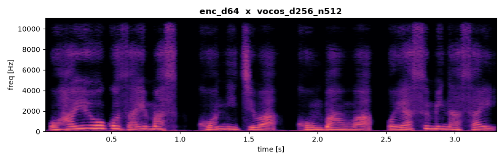](wav/enc_d64__vocos_d256_n512.mp4) |  | [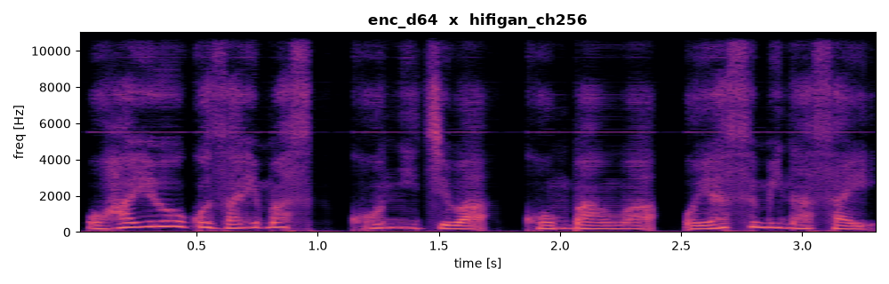](wav/enc_d64__hifigan_ch256.mp4) | [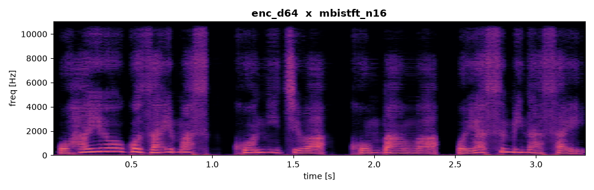](wav/enc_d64__mbistft_n16.mp4) |  |
| **enc_d96** |  |  | [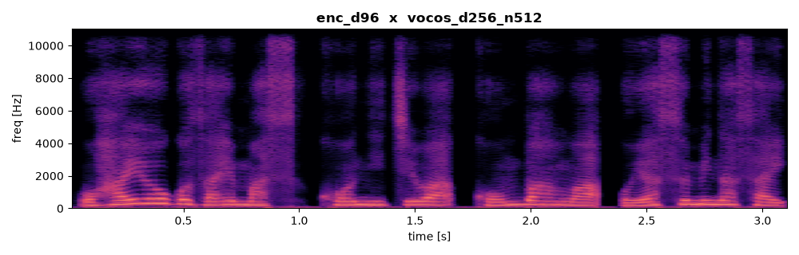](wav/enc_d96__vocos_d256_n512.mp4) |  |  |  | [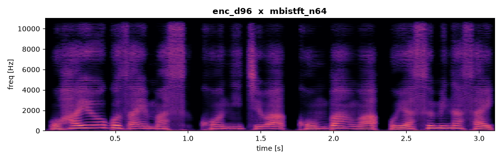](wav/enc_d96__mbistft_n64.mp4) |
| **enc_d128** |  | [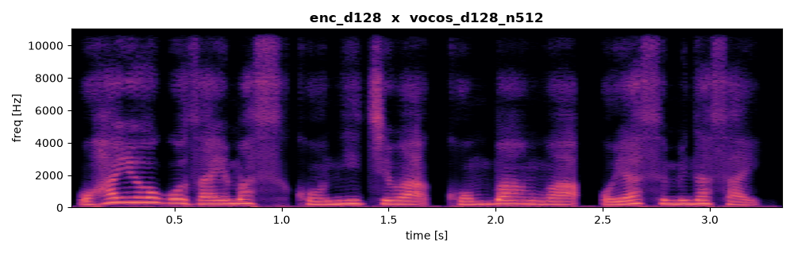](wav/enc_d128__vocos_d128_n512.mp4) |  | [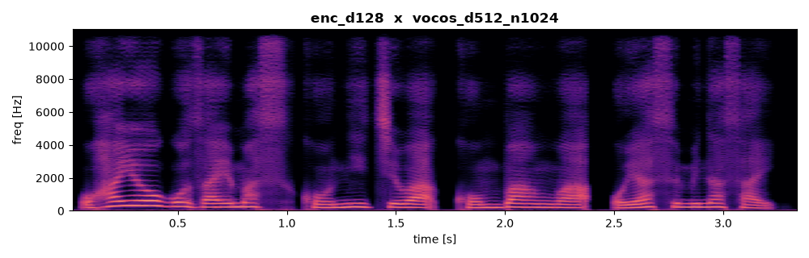](wav/enc_d128__vocos_d512_n1024.mp4) | [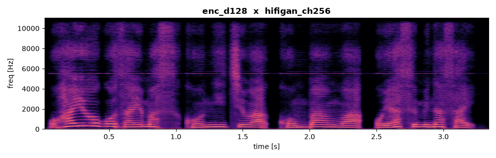](wav/enc_d128__hifigan_ch256.mp4) |  |  |
| **enc_d192** | [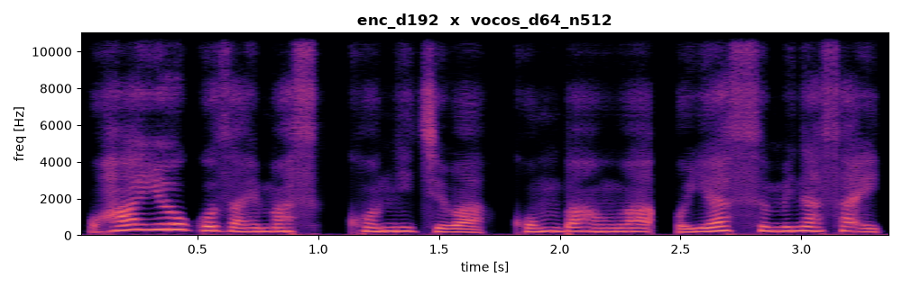](wav/enc_d192__vocos_d64_n512.mp4) |  |  | [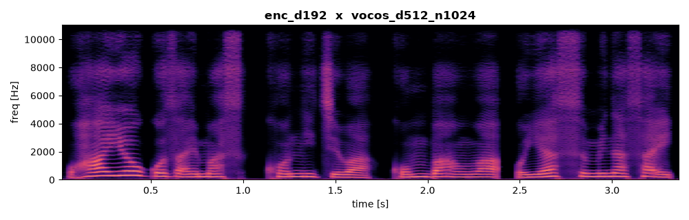](wav/enc_d192__vocos_d512_n1024.mp4) | [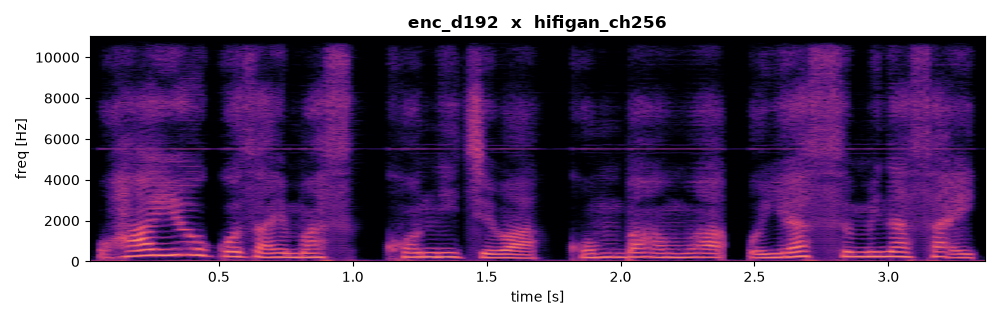](wav/enc_d192__hifigan_ch256.mp4) |  | [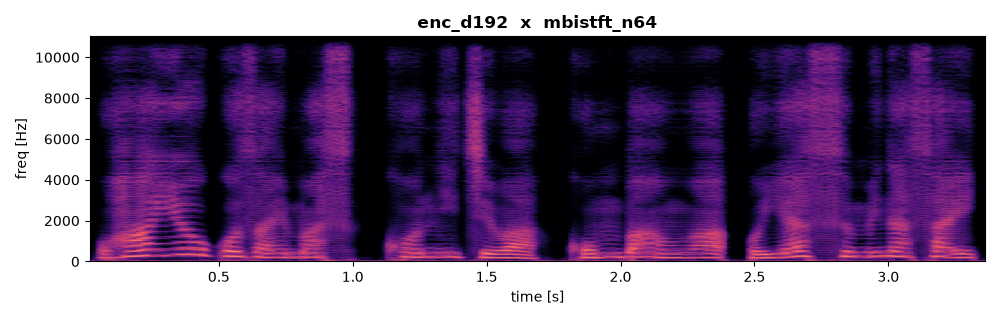](wav/enc_d192__mbistft_n64.mp4) |
| **enc_d256** | [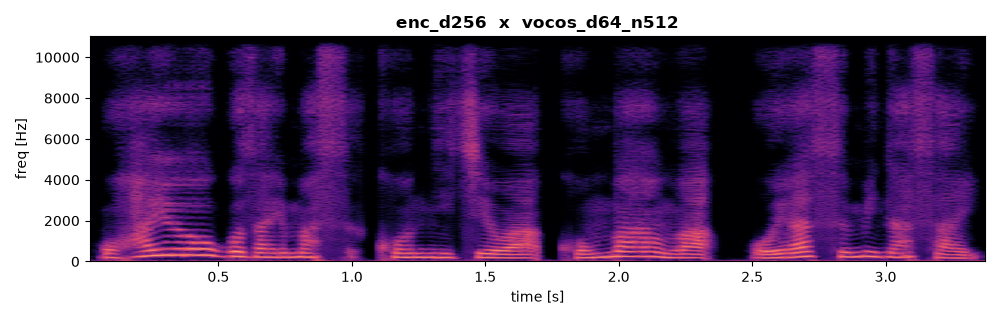](wav/enc_d256__vocos_d64_n512.mp4) |  | [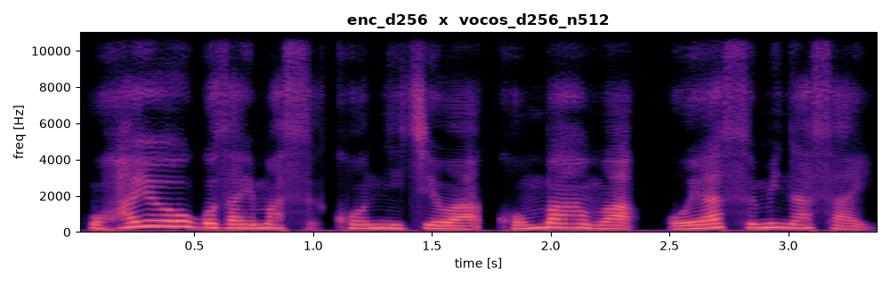](wav/enc_d256__vocos_d256_n512.mp4) | [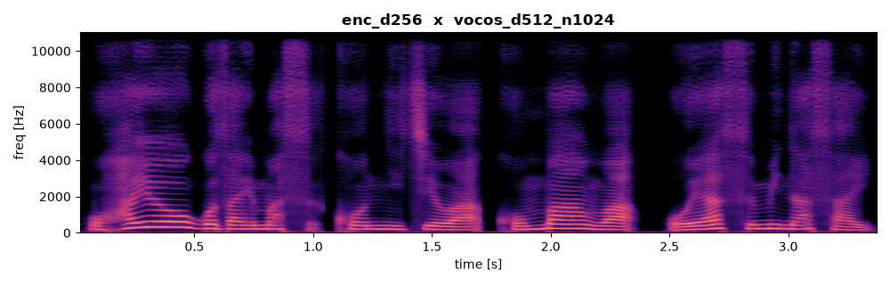](wav/enc_d256__vocos_d512_n1024.mp4) | [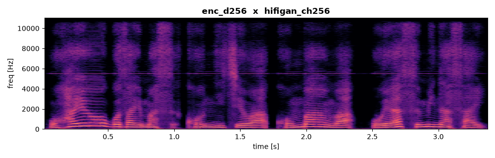](wav/enc_d256__hifigan_ch256.mp4) |  |  |
| **enc_d384** | [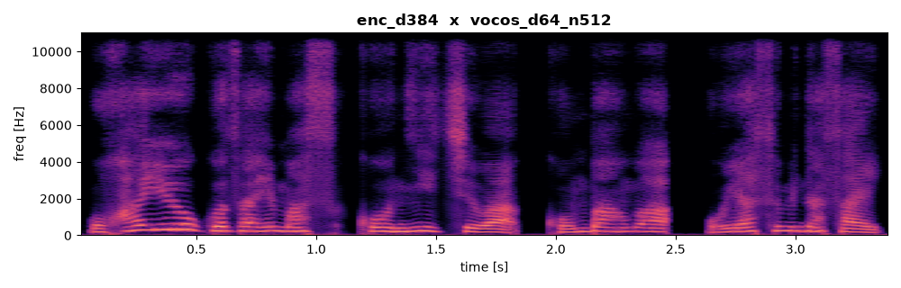](wav/enc_d384__vocos_d64_n512.mp4) |  | [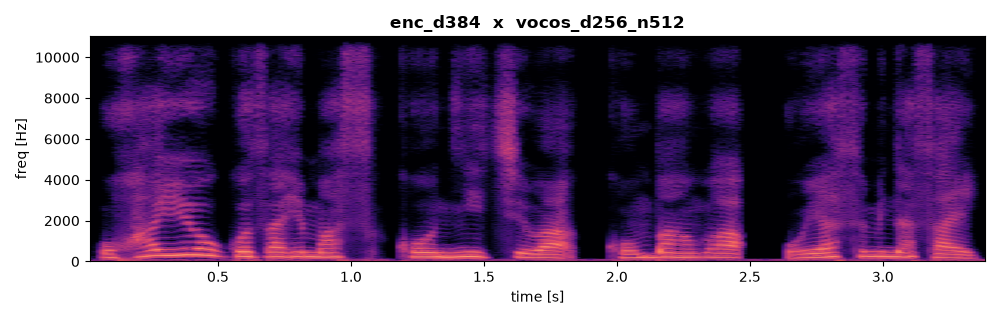](wav/enc_d384__vocos_d256_n512.mp4) |  | [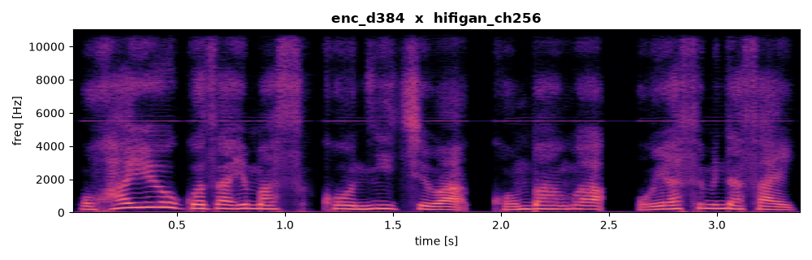](wav/enc_d384__hifigan_ch256.mp4) | [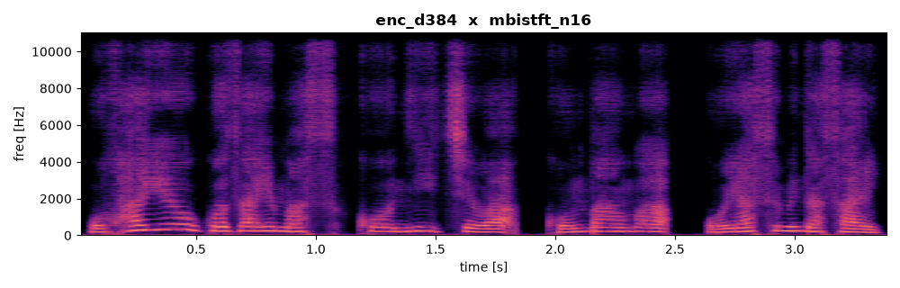](wav/enc_d384__mbistft_n16.mp4) |  |

